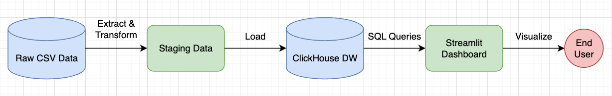
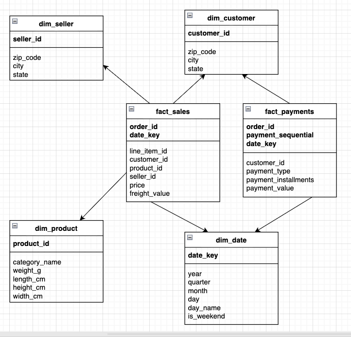
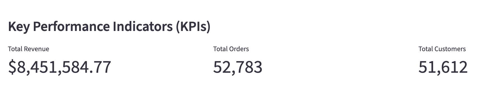
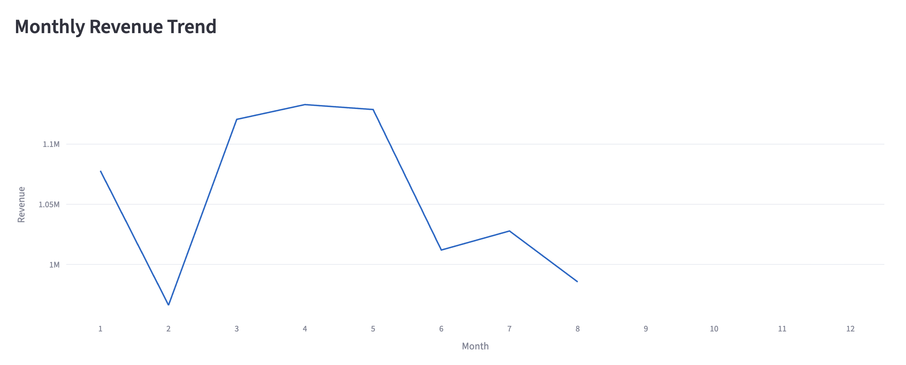
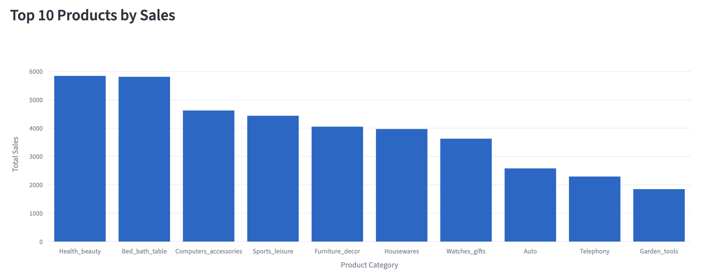
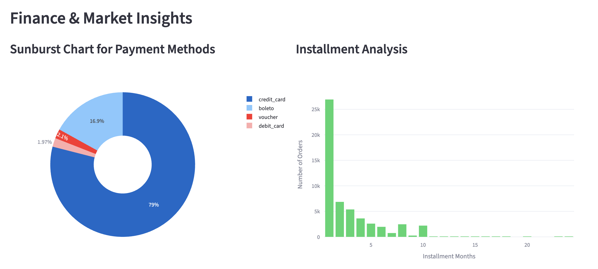
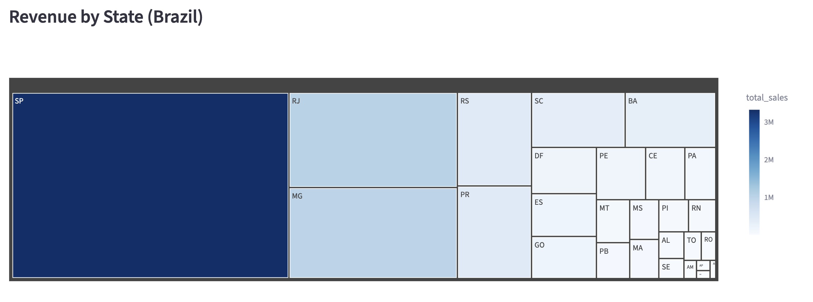

# Olist E-commerce Data Pipeline and Dashboard


## Overview

This project is an End-to-End Data Engineering solution designed to analyze the **Olist Brazilian E-commerce Public Dataset**.

The goal was to build a scalable Data Warehouse using **ClickHouse** to handle large datasets efficiently and provide actionable insights via an interactive **Streamlit** dashboard. The system follows the **Star Schema** modeling to optimize analytical queries (OLAP).

## Architecture

The pipeline follows the Extract-Transform-Load (ETL) pattern, fully containerized with Docker:



* **Key Components:**
    * **Source:** Olist Dataset (9 CSV files) containing Customers, Orders, Products, Sellers, etc.
    * **ETL Processor:** Python scripts (Pandas) to clean data, handle types and logic (e.g., merging payments/sales).
    * **Data Warehouse:** ClickHouse for high-speed aggregation.
    * **Data Modeling:** Star Schema with 4 Dimensions and 2 Fact tables.
    * **Visualization:** Interactive Dashboard built with Streamlit and Plotly.

## Data Model (Star Schema)

The Data Warehouse is designed based on **Star Schema** principles to optimize analytical performance:



* **Fact Tables:**
    * `fact_sales`: Contains transactional data (revenue, freight, dates, foreign keys).
    * `fact_payments`: Detailed payment records (installments, payment types).
* **Dimension Tables:**
    * `dim_customer`: Customer demographics and geolocation (State/City).
    * `dim_product`: Product attributes and categories.
    * `dim_seller`: Seller profiles.
    * `dim_date`: Time dimension for temporal analysis (Year, Month, Quarter, Weekend flags).

## Project Structure

```bash
olist_etl_pipeline/
├── dashboard/               # Frontend Application
│   └── app.py               # Streamlit Dashboard Source Code
├── data/                    # Data Storage (Volume Mapped)
│   └── raw/                 # Raw CSV files (Git ignored)
├── pipeline/                # ETL Logic (Backend)
│   ├── Dockerfile           # Environment definition
│   ├── requirements.txt     # Python Dependencies
│   └── transform_*.py       # Scripts for Dims and Facts tables
├── docker-compose.yml       # Orchestration
├── .env.example             # Environment Variables Template
└── README.md                # Project Documentation
```

## How To Run

* **Prerequisites:**
    * Docker and Docker Compose installed
    * Git installed

* **Step 1: Clone the repository**
```bash
git clone [https://github.com/anPham2004/olist-data-pipeline.git](https://github.com/anPham2004/olist-data-pipeline.git)
cd olist-data-pipeline
```

* **Step 2: Download data** <br />
Download the dataset from [Kaggle Olist Dataset](https://www.kaggle.com/datasets/olistbr/brazilian-ecommerce) and place the `.csv` files into the `data/raw/` folder.

* **Step 3: Setup environment** <br />
Create a `.env` file from the example:
```bash
cp .env.example .env
```

* **Step 4: Start the pipeline** <br />
Run the following command, the system will automatically: <br />
    * 1. Wait for the database to initialize <br />
    * 2. Create the `olist_dw` database <br />
    * 3. Run the full ETL pipeline <br />
    * 4. Launch the dashboard
```bash
docker-compose up --build
```

* **Step 5: Access dashboard** <br />
Once you see "Streamlit" logs in the terminal, go to: http://localhost:8501

## Dashboard Demo
Below are screenshots of the dashboard built with **Streamlit** and **Plotly**, demonstrating key insights derived from the data.
* **1. Executibe summary (KPIs)**
A high-level view of business performance. The dashboard calculates total revenue, order count and unique customers in real-time based on the selected year.


* **2. Sales trends and Product performance**
**Monthly Revenue Trend:** Visualizes seasonality and sales spikes throughout the year.


**Top Products:** Identifies best-selling categories (e.g., Health & Beauty, Bed Bath Table) to support inventory decisions.


* **3. Financial and Payment analysis**
**Payment Habits:** A Sunburst chart reveals that Credit Card is the dominant payment method (79%), followed by Boleto.
**Installments:** Analyzes the correlation between order volume and installment plans, showing a preference for 1-time payments but a significant long-tail of installment users.


* **4. Geospatial distribution**
**Revenue by State:** A Treemap visualization highlights Sao Paulo (SP) as the primary market, contributing the largest share of revenue, followed by RJ and MG.

